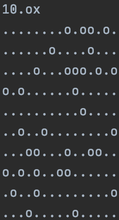
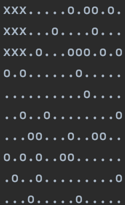

# bsq

## Introduction

BSQ is an app which takes as argument a map containing obstacles, and free space, represented by ascii characters, and outputs to stdout the same map with the biggest open square space filled in. In other words, it takes the map, finds the biggest square that can fit in the free space in the map, and fills it in with a character different to that of free space and obstacles.

## Usage
1. Clone this git repository
2. Compile the app by with `make`
3. Generate a new map using perl by executing `perl map_gen.pl {x} {y} {z}`. x is the width of the map, y is the height, and z is the percent of the map which you want to be covered in obstacles.
4. Execute the command `./BSQ {name of map}`

### Example
If the map is the following:

```
'.' - empty tile\
'o' - obstacle\
'x' - square tile\
```
Inputing the path to this map file as an argument to the BSQ map should output the following to stdout:

